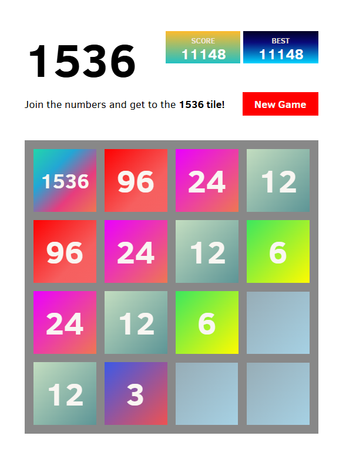
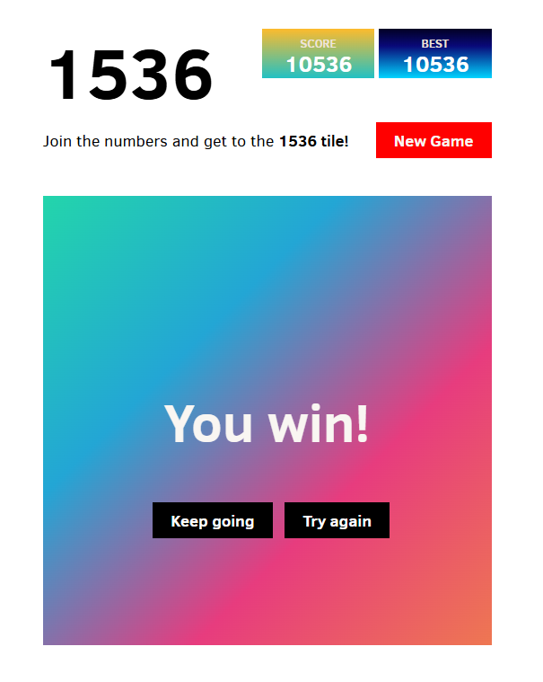

# 1536
A derivative of Gabriele Cirulli's wildly popular game 2048, which spawns '3' tiles with the end goal of 1536. You can continue if you want :)

### Screenshots

  
  

## License
1536 is a derivative of Gabriele Cirulli's 2048, which uses the MIT license.
This project is dual-licensed to respect the original work and its copyright while also ensuring that derivatives of this project remain open-source.

## Additions
If you would like to make any additions, changes, or improvements, please do so in a fork. This project is in a semi-dormant state.

1. **The MIT License** (original 2048 project terms) — see the [LICENSE-MIT.txt](LICENSE-MIT.txt) file.
2. **The GNU General Public License v3.0 (GPLv3)** (ensuring derivative works remain open-source) — see the [LICENSE-GPLv3.txt](LICENSE-GPLv3.txt) file.
